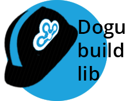

[](https://github.com/cloudogu/dogu-build-lib/blob/master/LICENSE)

# Dogu-build-lib

## About

dogu-build-lib is a shared library for [Jenkins pipelines](https://jenkins.io/doc/book/pipeline/). It adds functionality
to interact with the [Cloudogu EcoSystem](https://github.com/cloudogu/ecosystem)
and [Vagrant](https://www.vagrantup.com/) in general.

## Get started

- Install Plugin: [GitHub Groovy Libraries](https://wiki.jenkins.io/display/JENKINS/Pipeline+GitHub+Library+Plugin)
- Use in any Jenkinsfile as follows:

```groovy
@Library('github.com/cloudogu/dogu-build-lib@<COMMIT-ID>')
import com.cloudogu.ces.dogubuildlib.*
```

## Features

- [Ecosystem](#Ecosystem)
- [Vagrant](#Vagrant)
- [Cypress](#Cypress)

### Ecosystem

#### Get Started

```groovy
Ecosystem ecosystem = new EcoSystem(script, String gcloudCredentials, String sshCredentials)
// eg.
EcoSystem ecosystem = new EcoSystem(this, "gcloud-ces-operations-internal-packer", "jenkins-gcloud-ces-operations-internal")
```

#### Functions

- changeNamespace(String namespace) | change dogu namespace
- setVersion(String version) | define dogu version
- provision(String mountPath, machineType = "n1-standard-4", int timeoutInMinutes = 5) | provision to a specific path
- loginBackend(String credentialsId)  | login with credentials
- setup(config = [:]) | setup a ces instance based on a setup.json
- waitForDogu(String dogu) | wait until the dogu state is healthy
- waitUntilAvailable(String doguName, int timeout) | wait until a dogu is ready for interaction
- build(String doguPath) | build a dogu
- verify(String doguPath) | execute the goss tests
- push(String doguPath) | push dogu into registry
- destroy() | remove the generated ces instance
- collectLogs() | add logs as artifact to jenkins build
- purgeDogu(String doguName, String parameters = "") | executes cesapp purge command
- installDogu(String doguFullName) | executes cesapp install command
- upgradeDogu(newDoguVersion = "") | tests the dogu upgrade
- runYarnIntegrationTests() | runs yarn integration tests for the dogu
- runMavenIntegrationTests() | runs maven integration tests for the dogu
- upgradeFromPreviousRelease(String oldDoguVersionForUpgradeTest, String doguName, String namespace = "official") | upgrade dogu from previous version
- restartDogu(String doguName, boolean waitUntilAvailable=true) | Restarts a dogu and by default waits until it is available again.
- changeGlobalAdminGroup(String newAdminGroup) | Changes the global admin group to the given value.
- copyDoguImageToJenkinsWorker(String doguPath) | Copies the built Dogu image from the CES machine to the Jenkins worker and imports it into Docker

##### runCypressIntegrationTests():

```groovy
/**
 * Runs integration tests based on cypress. Is it necessary that the cypress integration test are inside a
 * relative path named `integrationTests` from the root.
 * @param version - The cypress image to use for running the integration tests. Default: "cypress/included:7.1.0".
 * @param enableVideoRecording - Determines whether cypress should record videos. Default: true.
 * @param enableScreenshotRecording - Determines whether cypress should record screenshots. Default: true.
 * @param timeoutInMinutes - Determines the complete timeout in minutes for the tests. Default: 15.
 * @param additionalDockerArgs - A list containing arguments that are given to docker.
 * @param additionalCypressArgs - A list containing argument that are given to cypress.
 */
void runCypressIntegrationTests(String cypressImage = "cypress/included:7.1.0", boolean enableVideoRecording = true, boolean enableScreenshotRecording = true, int timeoutInMinutes = 15, ArrayList<String> additionalDockerArgs = [], ArrayList<String> additionalCypressArgs = []) {
}
```

### Vagrant

#### Get Started

```groovy
Vagrant vm = new Vagrant(script, gcloudCredentials, sshCredentials)
```

#### Functions

- installPlugins(String plugin) | install additional vagrant plugins
- scp(String source, String target) | copy files to remote machine
- sync() | sync host and remote
- up() | start vm
- ssh() | connect to vm
- getExternalIP() | get ip for connection
- sshOut(String command) | execute command on vm
- destroy() | remove vm with all data

### Cypress

#### Get Started

```groovy
Cypress cy = new Cypress(script, LinkedHashMap<Object, Object> config)
```

#### The Configuration and their default values

```
# Name of the image to use for the integration tests.
cypressImage         : "cypress/included:7.1.0",

# Determines whether videos should be recorded
enableVideo: true,

# Determines whether scrshots should be taken when a test fails
enableScreenshots: true,

# Determines the timeout for the integration tests stage in jenkins
timeoutInMinutes: 15,

# Additional docker argument
additionalDockerArgs: "",

# Additional cypress argument
additionalCypressArgs: ""
```

#### Functions

- runIntegrationtests(EcoSystem ecoSystem) | Runs the integration tests
- archiveVideosAndScreenshots() | Archives the artifacts after the run has finished.
- preTestWork() | Should be executed before running the tests. Cleans the video, report, and screenshot folders.
- upgradeCypressConfiguration() | Updates the cypress.json with the currently set admin group.

### Samples

#### Sample Pipeline Script

This example shows the usage of Ecosystem, lintDockerfile and shellcheck (based on cloudogu/ldap jenkinsfile)

```groovy
#!groovy
@Library(['github.com/cloudogu/ces-build-lib@c622273', 'github.com/cloudogu/dogu-build-lib@f8cca7c9b101ed0bcdde8df556c13711d4cfd5a5'])
import com.cloudogu.ces.cesbuildlib.*
import com.cloudogu.ces.dogubuildlib.*

node('docker') {
    stage('Checkout') {
        checkout scm
    }

    stage('Lint') {
        lintDockerfile()
    }

    stage('Shellcheck') {
        shellCheck()
    }
}
node('vagrant') {

    timestamps {
        properties([
                // Keep only the last x builds to preserve space
                buildDiscarder(logRotator(numToKeepStr: '10')),
                // Don't run concurrent builds for a branch, because they use the same workspace directory
                disableConcurrentBuilds()
        ])

        EcoSystem ecoSystem = new EcoSystem(this, "gcloud-ces-operations-internal-packer", "jenkins-gcloud-ces-operations-internal")


        try {

            stage('Provision') {
                ecoSystem.provision("/dogu")
            }

            stage('Setup') {
                ecoSystem.loginBackend('cesmarvin-setup')
                ecoSystem.setup()
            }

            stage('Build') {
                ecoSystem.build("/dogu")
            }

            stage('Verify') {
                ecoSystem.verify("/dogu")
            }

        } finally {
            stage('Clean') {
                ecoSystem.destroy()
            }
        }
    }
}
```

See [ces-build-lib](https://github.com/cloudogu/ces-build-lib) for further functions

Icon based on: https://www.kissclipart.com/construction-helmet-icon-clipart-hard-hats-helmet-nv6hoi/ (Creative Commons)

---

## What is the Cloudogu EcoSystem?
The Cloudogu EcoSystem is an open platform, which lets you choose how and where your team creates great software. Each service or tool is delivered as a Dogu, a Docker container. Each Dogu can easily be integrated in your environment just by pulling it from our registry.

We have a growing number of ready-to-use Dogus, e.g. SCM-Manager, Jenkins, Nexus Repository, SonarQube, Redmine and many more. Every Dogu can be tailored to your specific needs. Take advantage of a central authentication service, a dynamic navigation, that lets you easily switch between the web UIs and a smart configuration magic, which automatically detects and responds to dependencies between Dogus.

The Cloudogu EcoSystem is open source and it runs either on-premises or in the cloud. The Cloudogu EcoSystem is developed by Cloudogu GmbH under [AGPL-3.0-only](https://spdx.org/licenses/AGPL-3.0-only.html).

## License
Copyright © 2020 - present Cloudogu GmbH
This program is free software: you can redistribute it and/or modify it under the terms of the GNU Affero General Public License as published by the Free Software Foundation, version 3.
This program is distributed in the hope that it will be useful, but WITHOUT ANY WARRANTY; without even the implied warranty of MERCHANTABILITY or FITNESS FOR A PARTICULAR PURPOSE. See the GNU Affero General Public License for more details.
You should have received a copy of the GNU Affero General Public License along with this program. If not, see https://www.gnu.org/licenses/.
See [LICENSE](LICENSE) for details.


---
MADE WITH :heart:&nbsp;FOR DEV ADDICTS. [Legal notice / Imprint](https://cloudogu.com/en/imprint/?mtm_campaign=ecosystem&mtm_kwd=imprint&mtm_source=github&mtm_medium=link)
